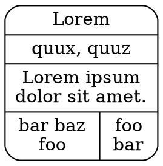
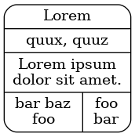
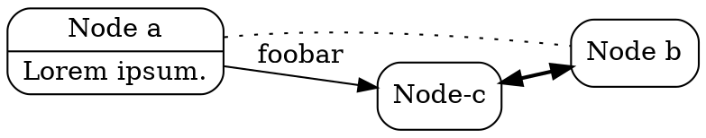
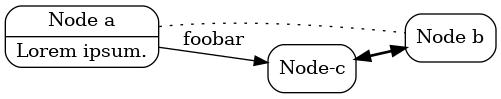

# yaddl

A simple diagram description language.

This was made to fulfill a pretty specific need I had, so it's probably not what you're looking for.
However, [`DOT`](https://en.wikipedia.org/wiki/DOT_(graph_description_language)) might be your friend!

## Usage

`yaddl` can output [`DOT`](https://en.wikipedia.org/wiki/DOT_(graph_description_language)) or `JSON`:

```bash
yaddl diagram.yaddl diagram.json
yaddl diagram.yaddl diagram.dot
```

## Language

### Defining a node

The simplest node you can define looks like this:

```
= node name
```

A `=` followed by a space and the name of the node.

You can then use additional annotations to further describe the node:

 - `#`: A list of comma-separated values, output is a comma-separated string in `DOT` and a list of strings in `JSON`.
 - `/`: A pair of values, with the second value being optional, space-separated. This means the first value should not contain any space. Output is a `[a, b]` list in `JSON` and `a | b` in `DOT`.
 - `'`: A string.

`#` is only allowed one per node. Multiple `/` will result in a list of pairs. Multiple `'` will result in a multi-line string. Interleaving `/` or `'` with other annotations is not permitted:

```
# quux, quuz
/ foo bar
/ baz qux
' Lorem ipsum
' dolor sit
' amet.
```

this is valid, but this isn't:

```
/ foo bar
# quux, quuz
/ baz qux
' Lorem ipsum
' dolor sit
' amet.
```

However, annotations ordering doesn't matter, and this is also valid:

```
' Lorem ipsum
' dolor sit
' amet.
# quux, quuz
/ foo bar
/ baz qux
```

A node with every annotation:

```
= Lorem
# quux, quuz
/ foo bar baz
/ bar foo
' Lorem ipsum
' dolor sit amet.
```

And the corresponding `JSON` and `DOT` outputs:

```json
{
  "edges": [],
  "nodes": [{
    "name": "Lorem",
    "links": [
      ["foo", "bar baz"],
      ["bar", "foo"]
    ],
    "comment": "Lorem ipsum\ndolor sit amet.",
    "tags": ["quux", "quuz"]
  }]
}
```



Output of `dot -Tpng node.dot > node.png`:



### Defining an edge

You can define undirected, bidirected and directed edges:

 - `-- a b`: Undirected edge
 - `<> a b`: Bidirected edge
 - `-> a b`: Directed edge, right to left
 - `<- a b`: Directed edge, left to right

Where `a` and `b` are node names. If a node name contains spaces, use `[node name]`.

Edges supports comments with `'`. Usage is the same as `'` in nodes.

## Putting it all together

**All nodes must be defined before edges**.

Nodes and edges can be separated by zero or more blank lines:

```
= Node a
' Lorem ipsum.
= Node b

= Node-c
-- [Node a] [Node b]

-> [Node a] Node-c
' foobar
<> Node-c [Node b]
```

Corresponding `JSON` and `DOT` outputs:

```json
{
  "edges": [
      {"direction": "Undirected", "node_b": "Node b", "comment": null, "node_a": "Node a"},
      {"direction": "Directed", "node_b": "Node-c", "comment": "foobar", "node_a": "Node a"},
      {"direction": "Bidirected", "node_b": "Node b", "comment": null, "node_a": "Node-c"}
  ],
  "nodes": [
      {"name": "Node a", "links": [], "comment": "Lorem ipsum.", "tags": []},
      {"name": "Node b", "links": [], "comment": null, "tags": []},
      {"name": "Node-c", "links": [], "comment": null, "tags": []}
  ]
}
```



And output of `dot -Tpng example.dot > example.png`:



## Install

Install [`stack`](https://docs.haskellstack.org/en/stable/README/#how-to-install), clone this repo and run `stack install`.
